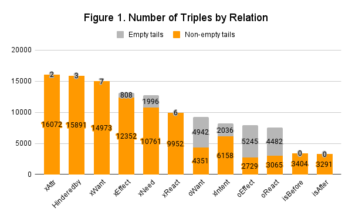

# Methodology

## Overview
This study investigates how different verb placements and clause orders in prompts impact the inference capabilities of LLMs. Using a Korean-translated version of the Atomic2020 dataset, we evaluated the GPT-3.5 Turbo model across 12 if-then relations with 4 distinct prompt styles, in both zero-shot and few-shot (10-shot) settings. The goal is to understand how these variations affect the accuracy of the model's inferences. Detailed experimental procedures and analysis methods are described in the following section.

## Corpus
### 1. Collection
To explore how inference performance in if-then relations varies with prompt syntax, we used the [Atomic2020](https://github.com/allenai/comet-atomic-2020) dataset, which is designed for commonsense reasoning about everyday events. We translated the dataset into Korean using machine translation. The Atomic2020 dataset is organized into triples: a Base Event (Head), a Relation, and an inferred Event (Tail). It includes 23 Relations set by researchers, with Heads automatically extracted from a corpus and Tails created through crowdsourcing based on the given Heads and Relations. The dataset contains approximately 1.33 million triples and is used both to evaluate whether machines can infer Tails similarly to humans and as training data. Although the Heads in Atomic2020 include both sentences and individual words like 'Apple,' this study focuses on if-then relations using only sentence-form Heads.

|Head|Relation|Tail|
|:---|:---:|:---|
|PersonX votes for PersonY|xIntent|to give support|
|PersonX runs out of steam|isBefore|PersonX hits the showers|
+ **Table 1. Examples from the Atomic2020 Dataset**

A Korean version of Atomic2020 existed previously, but it had poor translation quality. Therefore, we created a new machine-translated dataset called KR-Atomic to improve quality. We randomly sampled 3,000 Heads from this dataset for our experiments. For more details on the dataset creation process, please refer to the [KR-Atomic Repository](https://github.com/koreankiwi99/KR-Atomic).

### 2. Statistics
From the 3,000 Heads extracted through random sampling, we selected 2,528 Heads for the experimental corpus after excluding those with redundant meanings, grammatical errors, or interpretative issues. Table 2 provides the detailed statistics for this experimental corpus. The dataset contains a total of 122,526 triples, which reduces to 102,999 when excluding entries with empty Tails. On average, each Head consists of 7.40 morphemes, while each Tail is shorter, with an average of 4.88 morphemes.

||Count|Words|Morphemes|
|--|-----|-----|---------|
|Triples|122,526|-|-|
|w/o Empty Tails|102,999|-|-|
|Heads|2,528|3.71|7.40|
|Tails|53,355|2.39|4.88|
+ **Table 2. Statistics for the Experimental Corpus.** *Words* and *Morphemes* represent the average counts. Morphemes were counted using the [Mecab Tokenizer](https://github.com/Pusnow/mecab-ko-msvc).

A key observation, as shown in Figure 1, is that not all Head-Relation combinations lead to effective commonsense inference. Consequently, the distribution of Tails is biased depending on the Relation, indicating that some Relations are more likely to produce meaningful Tails than others.



## Experiment Setup
### 1. Basic Prompt Design
In this study, we aimed to evaluate how different verb placements and clause orders in prompts affect the inference performance of LLMs for twelve types of if-then relations. We designed four types of prompts with varied syntactic structures:

- `Prompt Type A`: This prompt is formatted as '{Question} : {Input Sentence}' and serves as the baseline for performance comparison. It presents the if-then relation in a question format.
- `Prompt Type B`: This prompt presents the task information in sentence form and is divided into three variations:
  - `Type B1`: This prompt is a direct translation from English, resulting in the verb naturally appearing at the end of the sentence. We used an instruction like "Fill in the blank" to have the LLM infer the missing content.
  - `Type B2`: This prompt retains the English instruction "Continue the sentence" by positioning the verb in a relative clause.
  - `Type B3`: This prompt changes the clause order from main clause-causal clause to causal clause-main clause, using the same "Fill in the blank" instruction as Type B1.

Each prompt was created based on the relation descriptions and templates from the ATOMIC and ATOMIC2020 datasets. However, some relations could not utilize all four prompt types due to their specific characteristics. For example, xAttr, which involves inferring actor attributes, was not suitable for verb movement or causal relationships, so only `Types A` and `B1` were used. Detailed information about all 44 prompts is provided in [Appendix 1](/docs/appendix01.csv).

|A|B1|B2|B3|
|--|-----|-----|---------|
|그가 다음의 사건을 벌인 이유는 무엇인가? : {Input}|빈칸을 채워라: {Input} 왜냐하면 그가 __것을 원했기 때문이다.|다음의 문장을 이어가라 : {Input} 왜냐하면 그가 원했던 것은 ___ |빈칸을 채워라 : 그는 ____것을 원했기에, {Input}|

+ **Table 3. Examples of the Four Prompt Types.** This table shows examples of the four different prompt types used for the xIntent Relation, which involves inferring the actor's intention. The *Input* values are taken from the Heads.

### 2. Few-shot Prompt Design
In addition to zero-shot inference, we conducted experiments using few-shot learning. The structure of the few-shot prompts was designed based on West et al. (2021) and is illustrated in Figure 2.
```
그가 다음의 사건을 벌인 이유는 무엇인가? 한 문장으로 답하라. 예시:

상황1: 그는 거실 페인트칠을 도왔다
답변1: 도움이 되고 싶어서다

상황2: 그는 20파운드를 감량했다
답변2: 더 보기 좋고 싶어서다

상황3: 그는 모든 과목에서 A를 받았다
답변3: 좋은 학교에 들어가고 싶어서다
…
상황9: 그는 거짓말을 했다
답변9: 잘못을 덮고 싶어서다

상황10: 그는 공 던지기 놀이를 했다
답변10: 놀고 즐기고 싶어서다

상황: 그는 새 지갑을 원했다
답변:
```
+ **Figure 2. Example of a Few-Shot Prompt for Type A and xIntent Relation**

For few-shot learning, we used 10 demonstration samples per prompt. Initially, we selected 100 triples per relation from the ATOMIC2020 dataset, ensuring a Google BLEU score of 0.4 or lower relative to our experimental data to avoid overlap. We then refined this selection to 20 high-quality samples per relation. To minimize bias, we randomly chose 10 out of these 20 samples for each inference task.

### 3. Experimental Model and Parameters
In this study, we used the GPT-3.5-turbo-1106 model provided by OpenAI for inference. This model was chosen because it is trained to better follow instructions compared to the previous GPT-3 model and offers faster inference speed compared to GPT-4. Additionally, various Korean-based LLMs were tested during the pilot phase, but none performed meaningfully in zero-shot settings and were thus excluded. For inference, the parameters were set to temperature 0.4, max tokens 100, frequency penalty 0.5, and presence penalty 0.5.

