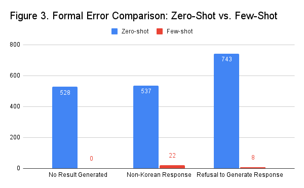
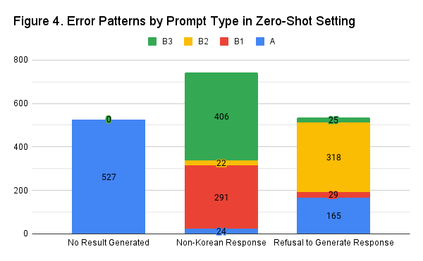

# Results

## Analysis of Formal Error Types
To effectively analyze the results, it is crucial to determine whether they logically align with the provided sentences and adhere to a commonsense "If-then" relationship. This process requires a complex approach. Therefore, before delving into content analysis, this study first identified the occurrence rate of formal errors by applying specific rules. Formal errors were categorized into three types:

- **No Result Generated**: Instances where the system fails to produce any answer.
- **Non-Korean Response**: Instances where the response is generated in a language other than Korean or Hangul.
- **Refusal to Generate Response**: Instances where the system refuses to generate an answer, often with messages like "I'm sorry, but there is no specific information available."

**Figure 3** illustrates a comparison of the number of formal errors between the zero-shot and few-shot settings. It was observed that in the few-shot setting, the overall number of errors significantly decreased compared to the zero-shot setting. Notably, there were no occurrences of **No Result Generated** errors, indicating a stronger tendency for the system to consistently generate answers in the few-shot setting.

**Figure 4** presents a detailed analysis of errors in the zero-shot setting, revealing distinct patterns based on the type of prompt used:

- **No Result Generated** errors occurred exclusively with Prompt Type A.
- **Non-Korean Response** errors were most common with Prompt Types B1 and B3.
- **Refusal to Generate Response** errors were predominantly found with Prompt Type B2.

These findings indicate that the structure of prompts may play a role in influencing the types of errors generated in the zero-shot setting. For detailed data on the number of errors categorized by relation and prompt type in the zero-shot setting, please refer to Appendix 2.
