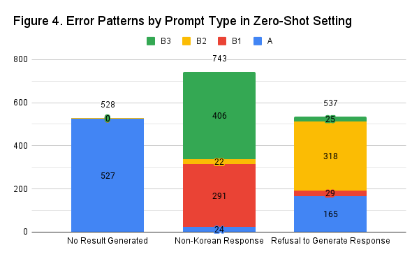

# Results

## Analysis of Formal Error Types
To effectively analyze the results, it is crucial to determine whether they logically align with the provided sentences and adhere to a commonsense "If-then" relationship. This process requires a complex approach. Therefore, before delving into content analysis, this study first identified the occurrence rate of formal errors by applying specific rules. Formal errors were categorized into three types:

- **No Result Generated**: Instances where the system fails to produce any answer.
- **Non-Korean Response**: Instances where the response is generated in a language other than Korean or Hangul.
- **Refusal to Generate Response**: Instances where the system refuses to generate an answer, often with messages like "I'm sorry, but there is no specific information available."

**Figure 3** illustrates a comparison of the number of formal errors between the zero-shot and few-shot settings. It was observed that in the few-shot setting, the overall number of errors significantly decreased compared to the zero-shot setting. Notably, there were no occurrences of **No Result Generated** errors, indicating a stronger tendency for the system to consistently generate answers in the few-shot setting.

**Figure 4** presents a detailed analysis of errors in the zero-shot setting, revealing distinct patterns based on the type of prompt used:

- **No Result Generated** errors occurred most frequently with Prompt Type A.
- **Non-Korean Response** errors were most common with Prompt Types B1 and B3.
- **Refusal to Generate Response** errors were predominantly found with Prompt Type B2.

These findings indicate that the structure of prompts may play a role in influencing the types of errors generated in the zero-shot setting. For detailed data on the number of errors categorized by relation and prompt type, please refer to [Appendix 2](/docs/appendix02.csv) and [Appendix 3](/docs/appendix03.csv).

## Content Analysis
### 1. Post-processing for Content Analysis
In this study, to ensure a fair comparison of experimental results, the prompts used were removed. Additionally, verb conjugations were converted to their base forms to make comparison easier. For instance, in the post-processed few-shot experiment results shown in Table 4, it was observed that removing the prompts sometimes led to identical results. However, while the few-shot approach produced relatively stable and consistent outputs, the zero-shot approach resulted in more variable outputs, making it challenging to convert all verbs to their base forms consistently.

|Head|A|B1|B2|B3|
|:---|:---|:---|:---|:---|
|그는 새 의자를 구입했다|가구 가게에 갔어야 한다|그는 새 의자를 구입했다. 이를 위해 그는 가구 가게에 갔어야 했다|그는 새 의자를 구입했다. 이를 위해 그가 했어야 한 것은 예산을 계획하는 것이다|그는 돈을 모았어야 했는데, 이는 새 의자를 구입하기 위해서였다|
|그는 일주일 동안 아팠다|의사를 찾아뵀어야 한다|그는 일주일 동안 아팠다. 이를 위해 그는 병원에 갔어야 했다|그는 일주일 동안 아팠다. 이를 위해 그가 했어야 한 것은 병원에 가는 것이다|그는 백신을 맞았어야 했는데, 이는 일주일 동안 아프기 위해서였다|
+ **Table 5. An example of post-processed few-shot experiment results for xNeed.** This example illustrates the importance of removing prompts to ensure a fair and accurate comparison of the content.

